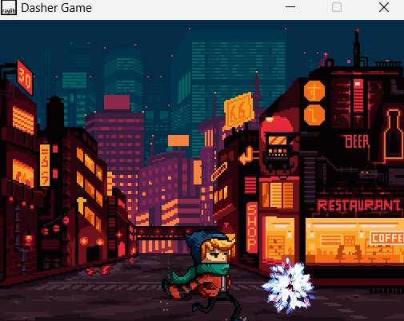
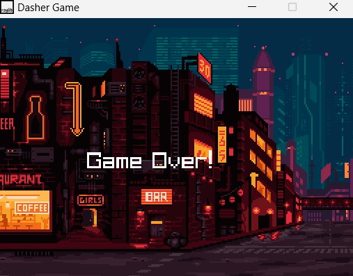

# Refactored-Dapper-Dasher
Overview - Dasher Game is a simple 2D side-scrolling game built using the raylib library. The player controls a character named "Scarfy" who must avoid obstacles and reach the finish line.

Features

1. 2D side-scrolling gameplay
2. Animated character and obstacles
3. Parallax scrolling background
4. Collision detection
5. Win and lose conditions

